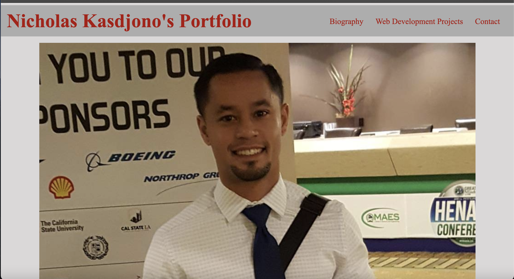
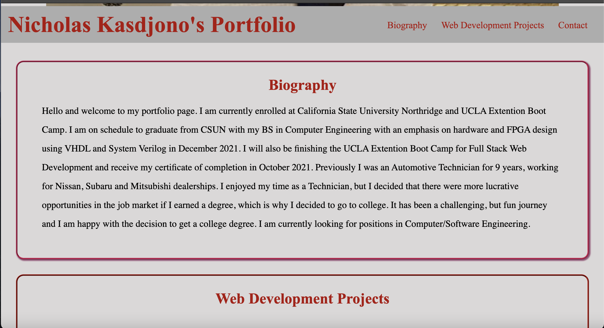
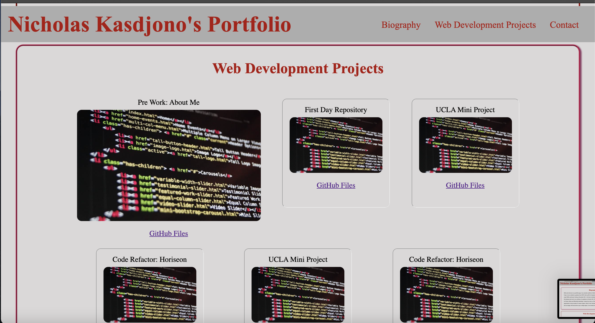
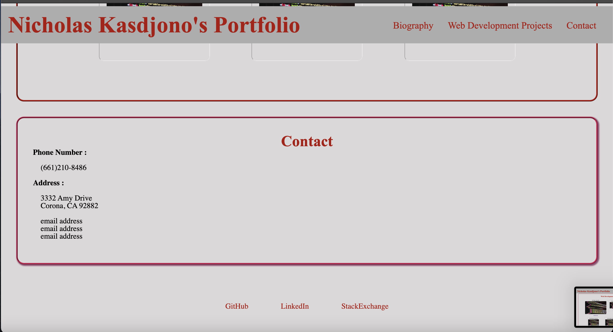

## Project Name : resume-portfolio 
 
 

## This is my personal profile for displaying my projects to employeers
 
 

## The following features have been added to the page:
 

        - My name, a recent photo or avatar, and links to sections about me, my work, and how to contact me
        - UI scrolls to the corresponding section
        - UI scrolls to a section with titled images of my applications
        - My first application image is larger in size than the others
        - Images of application will deploy the application
        - Is presented with a responsive layout

 

## Screen Shots of Profile Page
 

